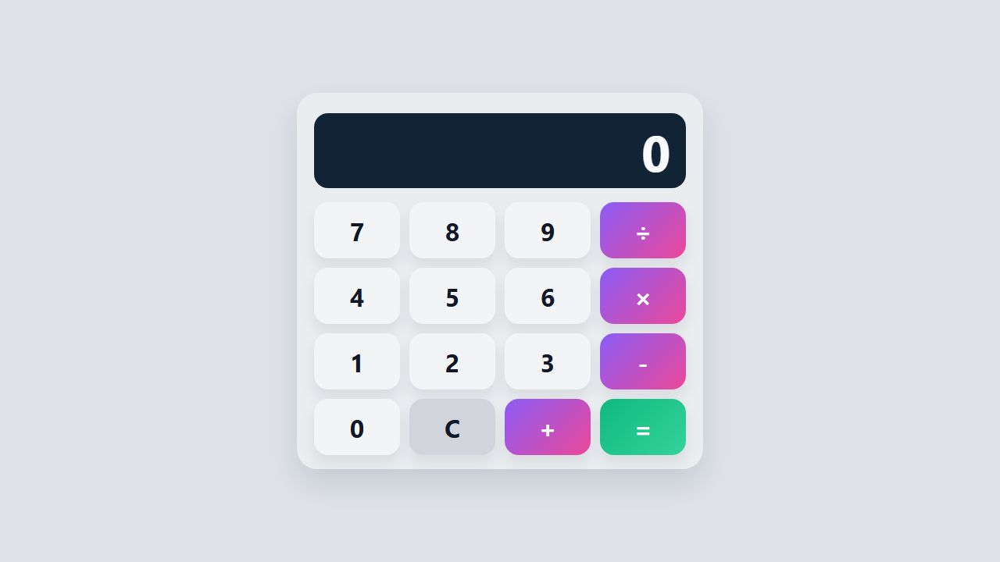

# Calculadora React

[](https://react.dev/)
[](https://styled-components.com/)
[](./LICENSE)

Uma calculadora simples, moderna e funcional desenvolvida com React e Styled Components, com foco em simplicidade visual, legibilidade de código e boa experiência de uso.

## 🌐 Demo online

Acesse a versão publicada em:

https://willvernen.github.io/calculadora-react/



## ✨ Funcionalidades

- Operações básicas: soma, subtração, multiplicação e divisão
- Visor com valor atualizado em tempo real
- Botão de limpar o visor
- Interface responsiva e visualmente próxima da referência proposta
- Estrutura organizada para fácil manutenção e evolução

## 🛠️ Stack utilizada

- React
- JavaScript
- Styled Components
- Create React App
- GitHub Pages

## ▶️ Como executar localmente

1. Clone este repositório
2. Acesse a pasta do projeto
3. Instale as dependências:

```bash
npm install
```

4. Inicie a aplicação:

```bash
npm start
```

5. Abra no navegador em:

```text
http://localhost:3000
```

## 📦 Build para produção

Para gerar a versão otimizada:

```bash
npm run build
```

Para publicar em GitHub Pages:

```bash
npm run deploy
```

## 📁 Estrutura principal

```text
calculadora/
├── public/
├── src/
├── package.json
├── README.md
├── LICENSE
├── preview.png
└── .gitignore
```

## 📄 Licença

Este projeto está licenciado sob a licença MIT. Consulte o arquivo [LICENSE](./LICENSE) para mais detalhes.

## 👤 Autor

Desenvolvido por WillVernen.
